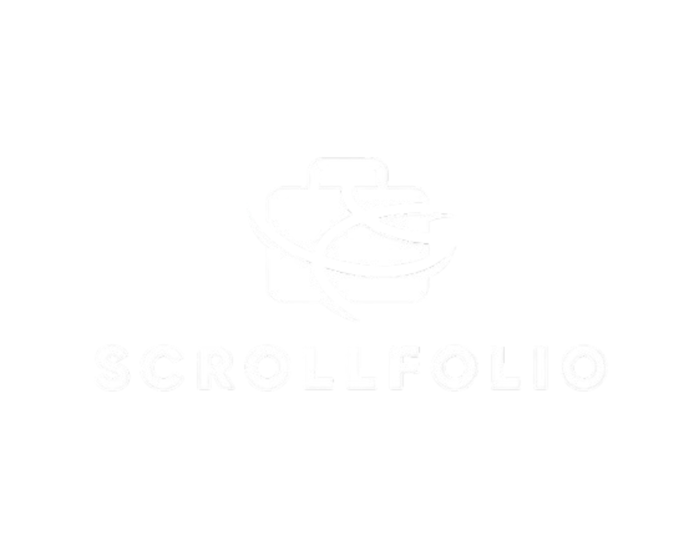

# Scrollfolio

<div align="center">
  
  


  **I made this project to actively showcase my dual expertise in both technical implementation (coding) and professional creative aesthetics (design)**

 [](https://github.com/Takshsingh313/Scrollfolio)
 [](https://axiom.hackclub.com/)
 </div>

<div align="center">
  <a href="https://moonshot.hackclub.com" target="_blank">
    
  </a>
</div>

# demo

 - Demo video of my working Portfolio : [Link](https://drive.google.com/file/d/1gk2i4yjjAF1wcjSTnMqegJCTzZOALBiR/view?usp=sharing)
   


## Features


## Project Structure

```
portfolio-project/
├── index.html                   (Main Portfolio Page)
├── contact.html                 (Fixed, non-scrolling Contact Form Page)
└── assets/
    ├── css/
    │   └── style.css            (All styling and layout)
    ├── js/
    │   └── animations.js        (All GSAP logic, data injection, and interactivity)
    └── images/
        └── [Logos & Profile]


```


---

## Author 
-  Email: takshsingh313@gmail.com
- Insta id : @ [__takshsingh__](https://www.instagram.com/_takshsingh_/)
- **Taksh Singh**
---

 
